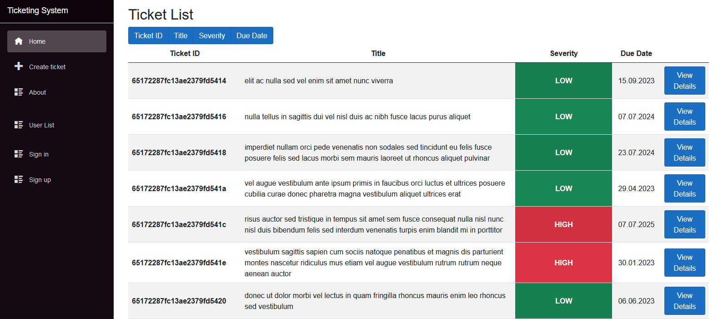

# Ticketing system

Simple ticketing system created using Blazor and .NET.
IT support tickets are saved into **tickets.xml** (will be improved)

| Frontend   | Backend    | Additional libraries |
|------------|-----------|------------|
| **Blazor** | **.NET**      | Bootstrap        |

## Features:
- Users can create IT support tickets
- Tickets can be viewed and filtered
- Tickets can be deleted upon completion
- Technician registration (WIP)

## Planned features:
- Profiles for Technicians, Administrators
- Sending emails to clients and technicians
- Generating PDF file of a ticket 
- Sending ticket with solution and files back to the client
- Tickets stored in database

